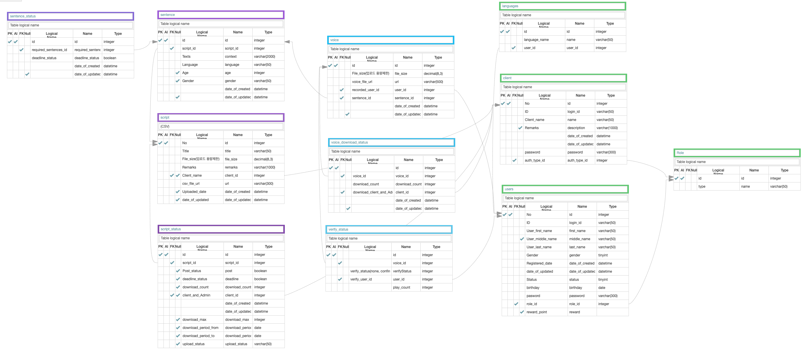

## Glovoice | 글로보이스
- 소개: 음성 클라우드 소싱 어플리케이션

## 개발 기간

- 기간: 2021.10.05 ~ 2021.10.28 (24일)

## 적용 기술

- Back-end : Typescript, NestJS, Prisma, PostgreSQL, AWS S3, AWS RDS, AWS EC2, Docker
- 협업툴     : Notion, Slack, Github, AQuery, Jenkins

## 구현 기능 및 개인 역할

`손명희`

[녹음할 문장 조회]
- 사용자가 회원가입시 입력한 언어, 성별에 따라 녹음할 문장 노출.
- Front에서 skip 버튼을 눌러 요청을 보낼 때 마다 문장이 random으로 노출.

[음성파일 업로드]
- AWS S3를 활용한 녹음파일 업로드

[사용자가 검증할 voice 조회]
- 해당 음성파일을 녹음한 사용자는 검증 불가.
- 사용자가 회원가입시 입력한 사용언어를 기준으로 노출

[검증할 voice play완료시 횟수 카운트]
- 음성파일이 1회이상 재생되어야 검증이 가능
- 음성파일 최초 1회 재생시 verify_statsus 생성.

[음성파일 검증-confirm]
- 음성파일 1회이상 재생 조건하에 검증 가능.

[음성파일 검증-reject]
- 음성파일 1회이상 재생 조건하에 검증 가능.

[음성파일의 검증 상태 조회]
- 목소리 1개당 1개의 verify_status가 생기므로 verify_status table에서 voice_id 필드가 unique로 설정 되어있음을 참고하여 조회

  

## EndPoint

[get] getOneSentence     : /script/sentence  

[post] uploadVoice       : /voice/upload?sentence_id=  

[post] playCountOfVoice  : /voice/upload?sentence_id=  

[post] confirmVoice      : /voice/verify/\<int:voice_verify_status_id>/confirm  

[post] rejectVoice       : /voice/verify/\<int:voice_verify_status_id>/reject  

[get] verifyStatus       : /voice/\<int:voice_id>/verify_status  

[get] getVerifySentence  : /voice/verify

## Modeling

## 레퍼런스

- 이 프로젝트는 본인이 (주)글로컬라이즈 인터쉽 기간 동안 진행한 `글로보이스` 프로젝트의 일부 소스코드이며, 글로컬라이즈의 동의하에 코드를 오픈합니다.
- 이 프로젝트의 저작권은 글로컬라이즈에 있으므로 해당 프로젝트를 통해 이득을 취하거나 무단 배포할 경우 법적으로 문제될 수 있습니다.